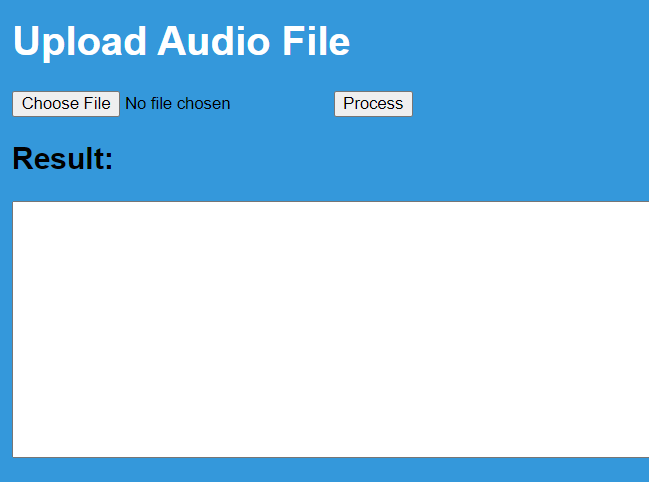
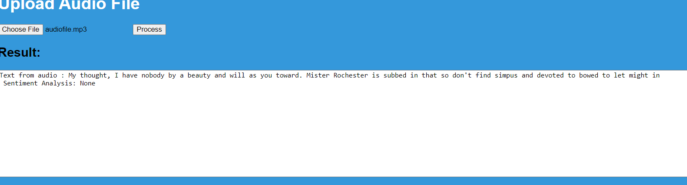

# Flask App  with Docker

## 💬 Description
> This is a machine learning application that changes audio to text and checks the sentiments. 
## 📜 More
## Flask
  1. The application uses flask to create an app for audio to speech conversion efficiently
    
## Deepgram Api 
  1. The application uses deepgram api to convert audio to json. 
## Openai Api 
  1. The application uses openai api to check the sentiments from the text that will be obtained from the json file.  
## Docker
  1. The application is using docker as the cloud service that will host the appllication.
     > 


## 💻🏃‍♂️ Running Code Snippet


   1. Clone the repo
        ```bash
          git clone https://github.com/jones0011738/audioapp.git
        ```
   1. Build docker image and run
        ```bash
            cd audioapp
            docker-compose up
        ```